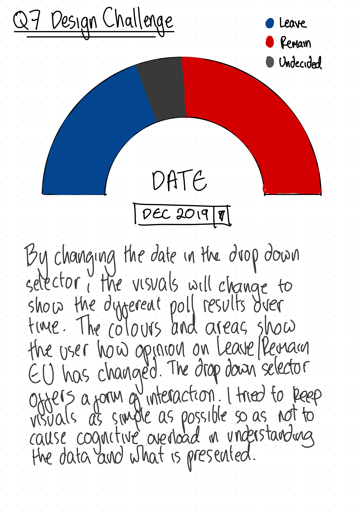

@import "../../css/datavis.less"

```elm {l=hidden}
import Tidy exposing (..)
import VegaLite exposing (..)
```

<!-- Everything above this line should probably be left untouched. -->

# Session 1: Practical Exercises

{(task|}

Use this document as a place to add your answers to the week's practical exercises.

{|task)}

## Q.3 Datavis Evaluation

\_Add your 5-point critique here (see Q.3 of the session 1 practical exercises).

The example I am choosing to critique is Migration Waves

https://www.informationisbeautifulawards.com/showcase/4191-migration-waves

1. Represents a complex dataset graphically that could not as effectively be represented via other means.

This dataset represents the last 50 years of migration across the globe. The black represents emigration (people leaving) and the white represents immigration (people relocating). It's clear to see which countries have had larger rates of emigration due to conflict and instablility, and which countries have had larger rates of immigration due to strong labour markets.

2. Often emphasises connections and comparisons between items of data.

This dataset shows connections between immigration and emigration due to conflict by using clear icons to demonstrate the conflict and the major destination as a result of people escaping that conflict. You can also compare the changes in data over time by following the Y axis.

3. Frequently involves interaction to allow a user to influence what they see.

The image isn't interactive, but it was published in a magazine as a fold out, which is more interaction than a normal flick the page sort of job.

4. A narrative supporting the construction of knowledge [human in the loop]

A narrative is provide on the left hand side, which introduces the dataset. There are also comments on signigicant areas surrounding the chart e.g. the strong labout markets influencing immigration in the USA, and recent conflict in Syria influencing their levels if emigration.

5. Generates an aesthetic response in order to encourage users to engage with the data or question.

I really enjoy this visualisation because it shows the movement of people across the globe which isn't just a 'journey map', which is what I'm more used to seeing. The difference between black and white sections helps you to study the data and notice patterns across time, place and the migration levels.

\_

## Q.4 Bicycle Hires Visualization

```elm {v}
bikehireBarchart : Spec
bikehireBarchart =
    let
        data =
            dataFromUrl "https://gicentre.github.io/data/bicycleHiresLondon.csv"

        enc =
            encoding
                << position X [ pName "Month", pTemporal ]
                << position Y [ pName "NumberOfHires", pQuant ]
    in
    toVegaLite [ width 640, data [], enc [], bar [] ]
```

## Q.5 Creating a Scatterplot

```elm {v}
bikehireScatterchart : Spec
bikehireScatterchart =
    let
        data =
            dataFromUrl "https://gicentre.github.io/data/bicycleHiresLondon.csv"

        enc =
            encoding
                << position X [ pName "NumberOfHires", pQuant ]
                << position Y [ pName "AvHireTime", pQuant ]
    in
    toVegaLite [ width 640, data [], enc [], circle [] ]
```

## Q.6 Data Challenge

```elm {v l}
opinionEUchart : Spec
opinionEUchart =
    let
        data =
            dataFromUrl "https://gicentre.github.io/data/euPolls.json"

        enc =
            encoding
                << position X [ pName "Date", pTemporal ]
                << position Y [ pName "Percent", pQuant ]
                << color [ mName "Answer", mNominal ]
    in
    toVegaLite [ width 640, data [], enc [], area [] ]
```

## Q.7 Design Challenge

_Add a link to a photo of your design sketch._



```markdown
    
```
